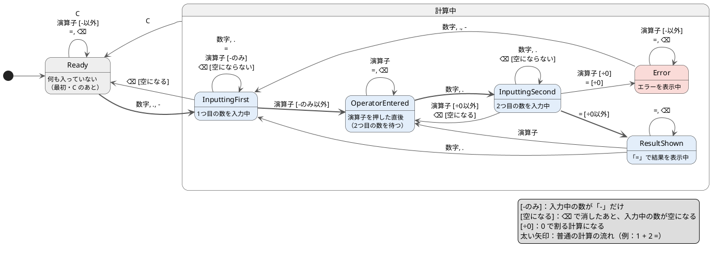

# 状態遷移図

```plantuml
@startuml
left to right direction
skinparam ArrowColor #555555

state Ready #EEEEEE
state 計算中 {
  state InputtingFirst #E3EEFA
  state OperatorEntered #E3EEFA
  state InputtingSecond #E3EEFA
  state ResultShown #E3EEFA
  state Error #FADBD8
}

Ready : 何も入っていない
Ready : （最初・C のあと）
InputtingFirst : 1つ目の数を入力中
OperatorEntered : 演算子を押した直後
OperatorEntered : （2つ目の数を待つ）
InputtingSecond : 2つ目の数を入力中
ResultShown : 「=」で結果を表示中
Error : エラーを表示中

[*] --> Ready
Ready <-- 計算中 : C

Ready --> Ready : C\n演算子 [-以外]\n&#61;, ⌫
Ready -[bold]-> InputtingFirst : 数字, ., -
Ready <-- InputtingFirst : ⌫ [空になる]
InputtingFirst --> InputtingFirst : 数字, .\n&#61;\n演算子 [-のみ]\n⌫ [空にならない]
InputtingFirst -[bold]-> OperatorEntered : 演算子 [-のみ以外]
OperatorEntered --> OperatorEntered : 演算子\n&#61;, ⌫
OperatorEntered -[bold]-> InputtingSecond : 数字, .
InputtingSecond --> InputtingSecond : 数字, .\n⌫ [空にならない]
InputtingSecond --> OperatorEntered : 演算子 [÷0以外]\n⌫ [空になる]
InputtingSecond --> Error : 演算子 [÷0]\n&#61; [÷0]
InputtingSecond -[bold]-> ResultShown : &#61; [÷0以外]
ResultShown --> ResultShown : &#61;, ⌫
ResultShown --> OperatorEntered : 演算子
ResultShown --> InputtingFirst : 数字, .
Error --> InputtingFirst : 数字, ., -
Error --> Error : 演算子 [-以外]\n&#61;, ⌫

legend right
  [-のみ]：入力中の数が「-」だけ
  [空になる]：⌫ で消したあと、入力中の数が空になる
  [÷0]：0 で割る計算になる
  太い矢印：普通の計算の流れ（例：1 + 2 =）
endlegend
@enduml
```
