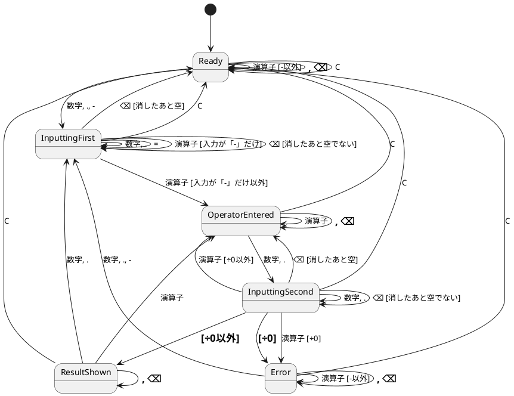

# 状態遷移図

```plantuml
@startuml
[*] --> Ready
Ready --> Ready : 演算子 [-以外]
Ready --> Ready : =, ⌫
Ready --> InputtingFirst : 数字, ., -
Ready --> Ready : C
InputtingFirst --> InputtingFirst : 数字, .
InputtingFirst --> InputtingFirst : =
InputtingFirst --> InputtingFirst : 演算子 [入力が「-」だけ]
InputtingFirst --> InputtingFirst : ⌫ [消したあと空でない]
InputtingFirst --> Ready : ⌫ [消したあと空]
InputtingFirst --> Ready : C
InputtingFirst --> OperatorEntered : 演算子 [入力が「-」だけ以外]
OperatorEntered --> OperatorEntered : 演算子
OperatorEntered --> OperatorEntered : =, ⌫
OperatorEntered --> InputtingSecond : 数字, .
OperatorEntered --> Ready : C
InputtingSecond --> InputtingSecond : 数字, .
InputtingSecond --> InputtingSecond : ⌫ [消したあと空でない]
InputtingSecond --> OperatorEntered : ⌫ [消したあと空]
InputtingSecond --> Ready : C
InputtingSecond --> Error : = [÷0]
InputtingSecond --> OperatorEntered : 演算子 [÷0以外]
InputtingSecond --> Error : 演算子 [÷0]
InputtingSecond --> ResultShown : = [÷0以外]
ResultShown --> ResultShown : =, ⌫
ResultShown --> OperatorEntered : 演算子
ResultShown --> InputtingFirst : 数字, .
ResultShown --> Ready : C
Error --> Ready : C
Error --> InputtingFirst : 数字, ., -
Error --> Error : 演算子 [-以外]
Error --> Error : =, ⌫
@enduml
```
